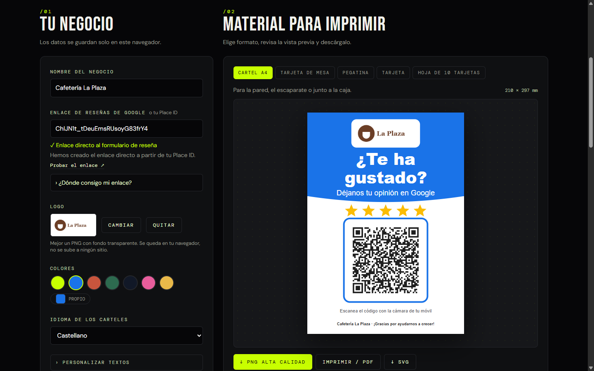
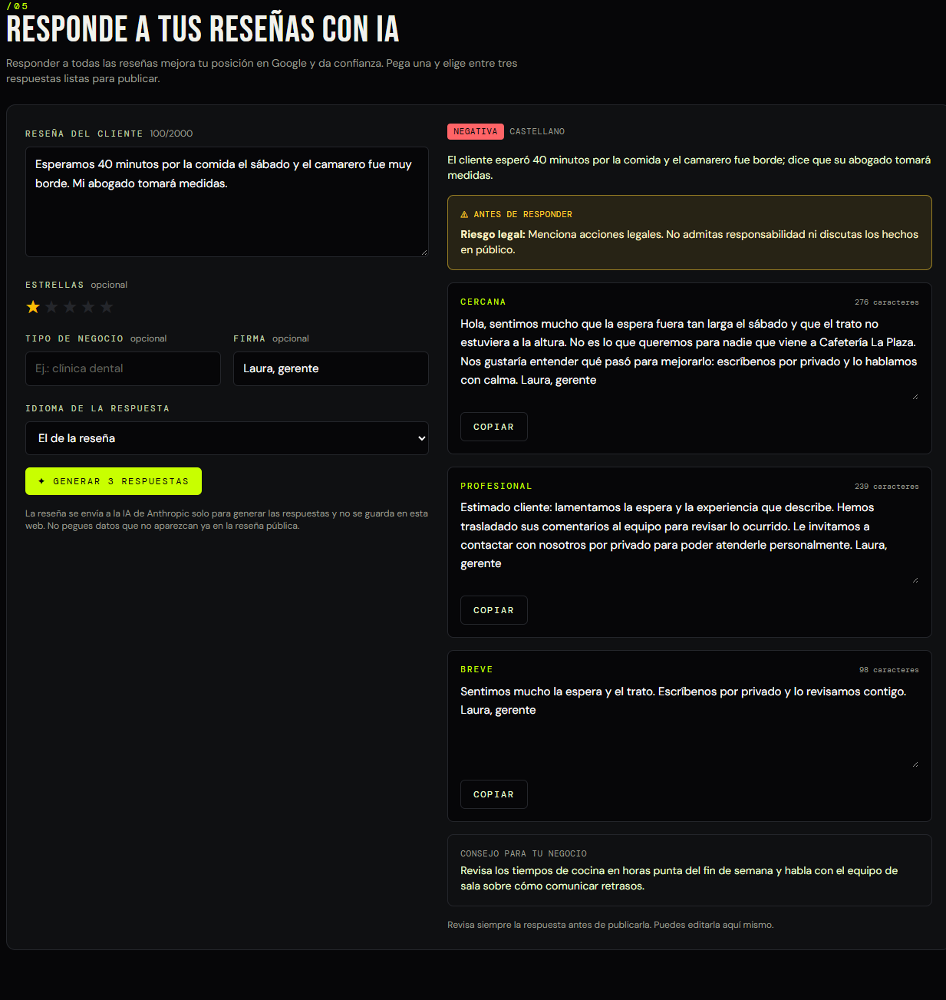

# Kit de reseñas para Google · DH Technology

Herramienta gratuita para que cualquier negocio local consiga más reseñas en Google y las responda bien. Pegas tu enlace de reseñas y en dos minutos tienes carteles con QR, tarjetas de mesa, mensajes listos para WhatsApp y una firma de email que llevan al cliente directamente a escribir su reseña. Y cuando llegan las reseñas, la IA te propone tres respuestas listas para publicar.

**[▶ Probar la herramienta](https://dht-resenas.vercel.app)** · Hecho por [DH Technology](https://h-com-bay.vercel.app)



## Qué hace

| | |
|---|---|
| **Valida el enlace** | Reconoce los enlaces de Google («Pedir reseñas», `writereview`, Maps o un Place ID suelto), los corrige y avisa si no abren directamente el formulario de reseña. |
| **5 formatos imprimibles** | Cartel A4, tarjeta de mesa que se dobla, pegatina de 100 mm, tarjeta de visita y hoja de 10 tarjetas con marcas de corte. |
| **Calidad de imprenta** | Descarga en PNG a 300 ppp, en SVG vectorial o en PDF a tamaño real desde el diálogo de impresión. |
| **Marca propia** | Logo, colores y textos personalizables, en castellano, inglés, catalán, euskera y gallego. |
| **Mensajes** | Plantillas para WhatsApp, SMS y email con el nombre del cliente, que se abren directamente en la app correspondiente. |
| **Firma de email** | Botón «Déjanos tu reseña» que se pega con formato en Gmail u Outlook. |
| **Respuestas con IA** | Pegas una reseña y Claude propone tres respuestas (cercana, profesional y breve) en su idioma, detecta el sentimiento y avisa de riesgos como datos de salud, amenazas legales o posibles reseñas falsas. |

## Respondedor de reseñas con IA



*Ejemplo con una reseña negativa que menciona acciones legales.*

- **Función de Vercel** en `api/responder.ts` que llama a la API de Claude (`claude-opus-5-5`) con salida JSON estructurada mediante un esquema.
- **Reintento automático** si los filtros de seguridad rechazan la petición, con el parámetro `fallbacks: "default"`.
- **Instrucciones pensadas para negocios reales:** respuestas específicas y sin inventar datos, sin admitir responsabilidad legal ni ofrecer compensaciones, y sin confirmar que alguien es paciente en negocios de salud.
- **Protección frente a inyección de instrucciones:** la reseña se trata como texto de un tercero y se aísla entre etiquetas.
- **Control de gasto:** límite de 8 consultas cada 10 minutos por IP, tope por instancia, solo acepta peticiones desde la propia web y limita la reseña a 2000 caracteres.

Para activarlo, añade la clave de la API en Vercel y vuelve a desplegar:

```bash
vercel env add ANTHROPIC_API_KEY production
vercel --prod
```

Fija también un límite de gasto mensual en la consola de Anthropic.

## Privacidad

Los carteles, mensajes y firmas se generan en el navegador, sin base de datos, cookies ni analítica, y las fuentes están alojadas en la propia web. Los datos del negocio y el logo se guardan solo en el `localStorage` del usuario. El texto de una reseña solo sale del navegador cuando el usuario pide respuestas con IA, y no se guarda.

## Detalles técnicos

- **QR vectorial propio.** Se genera con nivel de corrección Q y zona de silencio estándar, uniendo los módulos de cada fila en un solo trazado para que el SVG pese poco y se imprima nítido a cualquier tamaño. Las pruebas decodifican el QR de cada formato y comprueban que lleva al enlace exacto.
- **Carteles en SVG con milímetros reales.** Cada unidad del `viewBox` es un milímetro, así que el mismo diseño sirve para pantalla, PNG a 300 ppp e impresión a tamaño real con `@page`.
- **Texto que se ajusta solo.** SVG no parte líneas, así que se estima el ancho de cada palabra y se reduce el tamaño hasta que el texto cabe.
- **Casi sin coste de servidor.** Todo es estático salvo la función de IA, que solo espera la respuesta de la API y apenas consume CPU de Vercel.

## Stack

React 19 · TypeScript · Vite · Tailwind CSS 4 · qrcode · API de Claude · Vercel Functions · Vitest

## Desarrollo

```bash
npm install
npm run dev      # servidor de desarrollo
npm test         # 33 pruebas (QR, enlaces, carteles, API con cliente simulado)
npm run build    # compilación de producción en dist/
```

## Buenas prácticas incluidas

Las plantillas siguen las normas de Google: piden la opinión a todos los clientes y sin ofrecer nada a cambio. Google prohíbe los incentivos y filtrar a los clientes satisfechos, y puede eliminar reseñas o penalizar la ficha.

---

¿Quieres placas NFC, envío automático de mensajes tras cada venta o SEO local? **[Habla con DH Technology](https://h-com-bay.vercel.app/#contacto)**.
